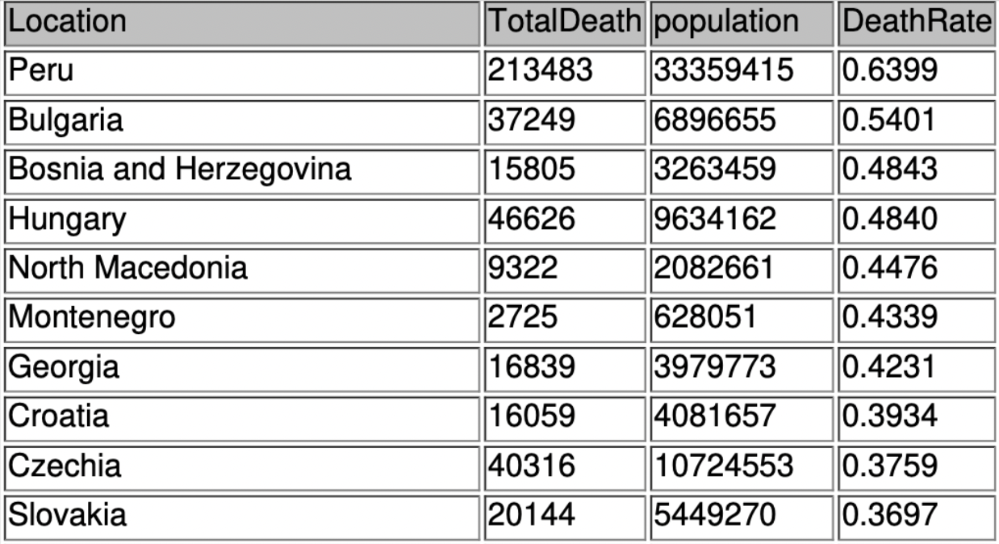

# Covid-19-Analysis-SQL

 Analysis of covid-19  death and infection level in SQL. I used the  data from
 World Health Organization to compare these metrics across all countries. As the summary I created 
 the view with the highest infected countries and and countries with the
 highest death rate.


## Skills applied

SQL, Data cleaning, Data importing


## Features

- joining tables
- creating views
- group by 
- sorting 
- filtering
-runing total


## SQL code
```{SQl}
-- Show countries with the highest death rate

SELECT Location,  MAX(total_deaths)  AS TotalDeath, population,  (MAX(total_deaths)/population)*100 AS DeathRate
FROM coviddeath
WHERE continent IS NOT NULL
GROUP BY location, population
ORDER BY 4 desc; 

```





## Instructions 

To see the whole code go to Covid.sql
    
